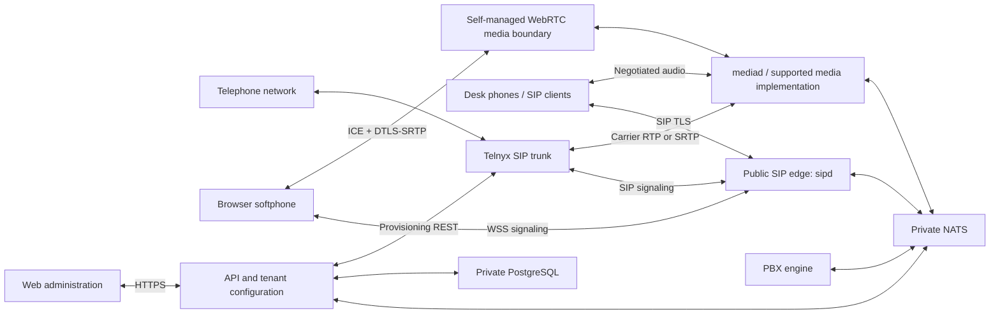

# Optimiq Voice: current repository readiness audit

Audited September 7, 2026, at commit 32b8499. Scope: the current API, web application, engine, Go SIP and media servers, shared packages, database boundaries, carrier integration, deployment configuration, and test coverage.

The intended product is a hosted business calling platform: Telnyx provides numbers and PSTN connectivity; Optimiq Voice owns organizations, extensions, registration, call routing, queues, call control, recordings, and the user experience. Advanced campaign dialing and AI agents are treated as possible product extensions, not assumed requirements for the first PBX release.

**Assessment: substantial implementation exists, but the current repository is not ready to deploy as a complete Telnyx-connected, multi-organization calling platform.** The largest gaps are between working components. Two were reproduced locally: API-produced trunks are rejected by the SIP consumer, and media commands fail when more than one media instance is running. Browser audio, credential authentication, tenant realms, and the deployment path also need implementation before a meaningful pilot.

This is an audit, not a production certification. No carrier calls, number purchases, account changes, production database changes, or deployments were performed.

## 1. What exists today

The repository directory is named fonoster, but its current package identity and application are Optimiq Voice. The active architecture has six application areas:

| Area          | Current responsibility                                                                                                          | Assessment                                                                                         |
| ------------- | ------------------------------------------------------------------------------------------------------------------------------- | -------------------------------------------------------------------------------------------------- |
| apps/api      | NestJS/Fastify API; organizations and permissions; PBX configuration; provisioning; Telnyx management; CDR and recording access | Broad implementation, with important integration gaps                                              |
| apps/web      | Next.js administration; user settings; live calls; routing editors; JsSIP softphone; reports                                    | Broad UI coverage; browser media is explicitly unsupported                                         |
| apps/engine   | Routing plan execution; queues; features; channel lifecycle; media and SIP commands                                             | Substantial runtime, still containing assumptions from the Asterisk driver                         |
| apps/sipd     | Go registrar; authenticated SIP admission; dialog handling; outbound origination; trunk supervision; subscriptions              | Much more than a registrar, but carrier authentication and shared tenant deployment are incomplete |
| apps/mediad   | Go SDP/RTP; two-party bridging; G.711/G.722; Opus relay; prompts; DTMF; recording; mixing and taps                              | Real media primitives, missing WebRTC and command ownership routing                                |
| apps/asterisk | Asterisk/ARI media implementation and container                                                                                 | Still the default deployed call path                                                               |

Shared packages include routing and telephony models, authentication, three database packages, TypeScript/Go event contracts, Telnyx REST integration, ARI, configuration, logging, and Effect runtime support.

“Implemented” below means current source and tests exist. It does not mean the complete feature was proven on a real Telnyx call.

| Capability                                                    | Current state                                        | Remaining work or qualification                                                          |
| ------------------------------------------------------------- | ---------------------------------------------------- | ---------------------------------------------------------------------------------------- |
| Organizations, members, roles and permissions                 | Implemented                                          | Prove two-tenant runtime isolation, including SIP and realtime events                    |
| Sessions, invitations, API keys, 2FA, email/reset flows       | Implemented                                          | Exercise authenticated deployment and configuration                                      |
| Tenant-scoped database access and RLS migrations              | Implemented                                          | Fresh database migration and non-owner integration gates remain unexecuted in this audit |
| Branding and user/organization settings                       | Implemented                                          | Deployment and permission acceptance                                                     |
| Extensions and device provisioning                            | Implemented                                          | Realm onboarding, multi-contact dialing and per-extension registration limits            |
| Telnyx number search/order/assignment/release                 | Implemented control plane                            | Live account reconciliation and call-path verification                                   |
| Telnyx trunk provisioning and status projection               | Partially connected                                  | Trunk JSON mismatch, credential resolver and digest authentication                       |
| Inbound DID routing                                           | Implemented compiler/runtime                         | Prove trusted carrier → DID → correct organization end to end                            |
| Outbound rules and trunk selection                            | Implemented                                          | Real authentication, identity headers, failover and media negotiation                    |
| Time conditions, schedules, IVRs and routing switches         | Implemented                                          | Real prompts, DTMF, timezone/DST and fallback acceptance                                 |
| Ring groups and queues                                        | Implemented                                          | Staffed call tests, queue contention and media behavior under load                       |
| Agent presence and wallboards                                 | Implemented                                          | Reconnection accuracy and live queue reconciliation                                      |
| Forwarding, follow-me, answer confirmation and call screening | Implemented                                          | Real multi-leg cleanup, caller identity and billing/CDR linkage                          |
| DND, feature codes, pickup and parking                        | Implemented                                          | Device interoperability and cross-instance acceptance                                    |
| Blind/attended transfer and other call controls               | Implemented                                          | Complete SIP/media/carrier tests, especially renegotiation                               |
| Shared lines                                                  | Configuration/compiler and supporting registry exist | Runtime dispatcher is missing; see finding 8                                             |
| Conferences                                                   | Runtime and media mixer exist                        | Capacity mismatch, bridge announcements, recording and gain controls                     |
| Voicemail deposit and mailbox/greeting handling               | Implemented                                          | Mounted storage and real media acceptance; do not confuse this with full call recording  |
| Voicemail email and transcription workers                     | Implemented                                          | Provider configuration and durable retry/recovery acceptance                             |
| Call recording, retention and archive/access APIs             | Mixed                                                | Existing media primitives are blocked by the engine capability/recording path on mediad  |
| Supervision: listen/whisper/barge                             | Mixed                                                | Tap primitives exist; engine capability guard blocks the new media driver                |
| Dial by name                                                  | Runtime exists                                       | Uses recorded names; missing names are skipped; no built-in TTS fallback                 |
| HTTP audio stream destination                                 | Fallback works; stream playback does not             | Implement actual streaming if this destination is advertised                             |
| CDRs, linked legs, exports and live events                    | Implemented                                          | Reconcile against real call outcomes and interruption/replay scenarios                   |
| Emergency addresses, ELIN routing and notifications           | Partial                                              | Carrier validation/activation is missing                                                 |
| Fax                                                           | Telnyx-backed API/workers exist                      | No complete fax UI found; native T.38 is not implemented by mediad                       |
| Programmable calling/application sessions                     | Implemented foundation                               | Eight advertised verb families are refused by the current executor                       |
| SSO and reseller administration                               | Backend surfaces exist                               | No corresponding complete administration UI found                                        |
| Browser softphone                                             | UI and WSS/SIP signaling exist                       | DTLS-SRTP, ICE and TURN integration are missing                                          |
| Native mobile/desktop calling                                 | No application found                                 | Optional separate scope, including background/push call handling                         |
| Campaign dialer, lead lists and dispositions                  | No complete workflow found                           | Optional contact-center expansion, distinct from manual outbound calling                 |
| Real-time AI voice agent                                      | No complete pipeline found                           | Optional streaming STT/TTS, interruption and agent orchestration work                    |

## 2. Confirmed launch blockers and runtime gaps

Priorities: P0 blocks the requested initial calling platform. P1 blocks a dependable full-feature release or scaling. P2 is product completion that depends on the chosen launch scope.

### 1. P0 — API-created trunks are rejected by sipd

The API publishes trunkId, orgId and secretRef. The Go directory reader expects id, organizationId and sipSecretRef. JSON decoding succeeds but leaves the required Go identity fields empty; configuration validation then rejects the trunk. A valid-looking trunk in the administration UI therefore does not become a usable SIP gateway.

Evidence: [API projection](/Users/jayarajsrivathsavadari/Documents/Github/fonoster/apps/api/src/pbx/trunks/trunk-directory.publisher.ts:364), [Go record](/Users/jayarajsrivathsavadari/Documents/Github/fonoster/apps/sipd/internal/trunk/directory.go:38), [watcher validation](/Users/jayarajsrivathsavadari/Documents/Github/fonoster/apps/sipd/internal/trunk/directory.go:297).

**Reproduced:** invoked the actual TypeScript projection with a synthetic trunk, passed its JSON into the actual Go Record.Config/Validate path using a Go overlay, and received “a trunk needs an id” and “a trunk needs an org.” No repository implementation was changed.

Required: consume the shared generated contract or explicitly adapt it once; add a producer-to-consumer test using the real projection; verify create/update/disable/delete and re-projection through NATS. Existing isolated fixtures do not catch this.

### 2. P0 — The provisioned Telnyx credential trunk cannot authenticate

The API provisions a Telnyx credential connection and outbound voice profile, then configures a register trunk. The registrar issues a plain sipgo Client.Do request. A 401/407 becomes TriggerChallenged; there is no password resolver or digest retry in that path. The installed sipgo client has a separate digest-auth method; its ordinary Do method does not perform the retry described by the repository comment.

Outbound INVITE also sends a plain transaction. AuthUser/AuthRealm are copied into a target but not used for a challenge response. The generic Contact is not constructed from the trunk authentication username.

Evidence: [carrier provisioning](/Users/jayarajsrivathsavadari/Documents/Github/fonoster/apps/api/src/pbx/carrier/carrier.service.ts:512), [REGISTER implementation](/Users/jayarajsrivathsavadari/Documents/Github/fonoster/apps/sipd/internal/trunk/register.go:67), [outbound transaction](/Users/jayarajsrivathsavadari/Documents/Github/fonoster/apps/sipd/internal/invite/originate.go:51), [INVITE headers](/Users/jayarajsrivathsavadari/Documents/Github/fonoster/apps/sipd/internal/invite/originate.go:325).

The API returns the carrier password at provisioning and retains a carrier reference/secret handle. It does not wire a mechanism for sipd to resolve that handle. The extension credential RPC serves a different purpose and cannot substitute for trunk credentials.

Required: secure carrier credential resolution with bounded caching/rotation, REGISTER and INVITE challenge handling, stale/repeated challenge limits, correct transaction/CSeq/ACK behavior, and per-trunk identity headers. Telnyx specifies the authentication username in the initial INVITE Contact or X-Telnyx-Username for this connection mode. [Telnyx SIP reference](https://sip.telnyx.com/)

An alternative for fixed public servers is a managed IP-authenticated connection. That requires implementing its provisioning and trust boundaries; the current managed carrier flow only creates credential connections. Both are supported architectural options. [Telnyx authentication methods](https://developers.telnyx.com/docs/voice/sip-trunking/authentication/credential-types)

### 3. P0 — Shared multi-organization SIP registration has no realm dispatch

One sipd process has one SIPD_REALM and one authenticator. It rejects credentials from another realm. The API resolves one realm to exactly one organization and refuses ambiguous matches. Consequently, simply assigning distinct domains to several organizations does not make one shared edge serve them.

Evidence: [realm verification](/Users/jayarajsrivathsavadari/Documents/Github/fonoster/apps/sipd/internal/registrar/auth.go:188), [API realm lookup](/Users/jayarajsrivathsavadari/Documents/Github/fonoster/apps/api/src/pbx/sip-credentials/sip-credentials.service.ts:223), [softphone realm resolution](/Users/jayarajsrivathsavadari/Documents/Github/fonoster/apps/api/src/provisioning/softphone/softphone.service.ts:95).

Required: a unique verified realm/domain directory, realm-aware challenges and credential lookup, domain onboarding and certificate handling, and scoped contact/dialog resolution. Test two organizations both using extension 1001. Separate sipd deployments per tenant could be an explicitly supported interim topology, but are not provisioned by the current deployment.

This is a deployment/availability gap, not a demonstrated cross-tenant data leak.

### 4. P0 — Browser signaling exists, browser audio does not

The credential API explicitly returns webrtcSupported: false. JsSIP uses the browser WebRTC connection, while mediad emits RTP/AVP and handles ordinary RTP. WSS secures signaling; it does not translate browser media into carrier audio.

Evidence: [explicit API capability](/Users/jayarajsrivathsavadari/Documents/Github/fonoster/apps/api/src/provisioning/softphone/softphone.service.ts:121), [JsSIP adapter](/Users/jayarajsrivathsavadari/Documents/Github/fonoster/apps/web/lib/softphone/jssip-adapter.ts:15), [media SDP implementation](/Users/jayarajsrivathsavadari/Documents/Github/fonoster/apps/mediad/internal/rtp/sdp.go).

Required: ICE negotiation, STUN/TURN configuration and short-lived relay credentials, DTLS fingerprint validation and SRTP, RTCP multiplexing, browser/carrier codec negotiation, and real browser audio/device testing. Carrier-side SRTP needs its own supported negotiation mode as well. Media may be implemented directly or through a self-managed media gateway; organization routing can remain entirely in this platform.

Test Chrome and Safari across ordinary NAT and TURN-only networks, permission refusal, output-device selection, reconnect and network changes. Never declare this complete from a successful REGISTER.

### 5. P0 — The deployment does not start the new SIP/media system

The default compose stack contains Asterisk and points the engine at ARI. It has no sipd or mediad services. The engine's media selection defaults to ari, and compose does not pass the new driver setting. The Go services have no corresponding production Dockerfiles/image publication path. sipd also defaults INVITE handling off and credentials to file mode.

Evidence: [compose Asterisk service](/Users/jayarajsrivathsavadari/Documents/Github/fonoster/compose.yaml:192), [engine ARI configuration](/Users/jayarajsrivathsavadari/Documents/Github/fonoster/compose.yaml:256), [driver factory](/Users/jayarajsrivathsavadari/Documents/Github/fonoster/apps/engine/src/media/ari.module.ts:51), [SIP defaults](/Users/jayarajsrivathsavadari/Documents/Github/fonoster/apps/sipd/internal/config/config.go:346), [image publishing](/Users/jayarajsrivathsavadari/Documents/Github/fonoster/.github/workflows/publish-images.yaml).

Required: select and document the supported launch topology; build/version/publish Go images; wire environment, NATS permissions, ports, public addresses, certificates, media mounts, secrets, startup probes and draining; provide rollback and an installation smoke test. The base compose file also lacks the media sharing present in the development overlay.

Asterisk remains an available implementation, but its presence in compose is not evidence that the administration-created Telnyx trunk or the browser path is configured end to end. Legacy configuration and examples require explicit verification.

### 6. P1 — Adding a second mediad makes commands fail

All media instances join the same queue group on the same RPC subjects. The directory records a session's owner, but subsequent engine requests still use the shared subjects. A non-owning instance returns wrong_instance and the engine has no owner-directed reroute. Initial A/B allocations can also land on different instances that cannot directly bridge their local sessions.

Evidence: [shared queue group](/Users/jayarajsrivathsavadari/Documents/Github/fonoster/apps/mediad/cmd/mediad/main.go:39), [subscriptions](/Users/jayarajsrivathsavadari/Documents/Github/fonoster/apps/mediad/internal/control/control.go:250), [engine transport](/Users/jayarajsrivathsavadari/Documents/Github/fonoster/apps/engine/src/media/mediad-transport.ts), [directory design](/Users/jayarajsrivathsavadari/Documents/Github/fonoster/apps/mediad/internal/directory/directory.go:1).

**Reproduced:** started two actual mediad binaries and an isolated NATS server locally. Created one synthetic session and sent 24 hold/unhold requests using the production RPC subjects. Results: 13 succeeded and 11 returned wrong_instance. Both processes and the temporary container were removed.

Required: deterministic session-owner addressing, allocation placement/capacity, A/B and conference co-location or an explicit inter-media transport, idempotent retry behavior, stale-owner recovery, and graceful node draining. A single-instance pilot can be limited explicitly while this is built; unrestricted horizontal scaling cannot.

### 7. P1 — Recording and supervision are blocked above working media primitives

Mediad has recording and tap capabilities, including a both-directions recording method. Its adapter still reports bridgeMode as proxy-media. The domain supportsRecording/supportsMediaBug predicates accept only media, so call recording and supervision are refused before reaching those capabilities. The existing call-recording implementation also relies on an Asterisk-style snoop channel, which the split-plane path refuses.

Evidence: [adapter capability](/Users/jayarajsrivathsavadari/Documents/Github/fonoster/apps/engine/src/media/mediad-media.port.ts:158), [recording guard and snoop](/Users/jayarajsrivathsavadari/Documents/Github/fonoster/apps/engine/src/calls/call-control.ts:2297), [capability predicates](/Users/jayarajsrivathsavadari/Documents/Github/fonoster/packages/telephony/src/bridge.ts).

Required: express actual driver/codec capabilities and connect call-control recording to the appropriate media primitive; implement the matching stop/completion/archive lifecycle. Do not merely flip the mode string: the snoop dependency would remain. Exercise manual and automatic extension/queue/conference recording and authorized supervision. Voicemail deposit uses a different recording path and is not wholly missing.

### 8. P1 — Shared-line configuration has no executable routing node

The compiler produces a shared-line node, but the plan walker's switch has no shared-line case. It falls through to FACILITY_NOT_IMPLEMENTED. Registry and heartbeat code exist, but this does not supply seize/ring/hold/recall execution. SIP shared-line notification work also remains unfinished.

Evidence: [compiler](/Users/jayarajsrivathsavadari/Documents/Github/fonoster/packages/routing/src/compile.ts:2645), [runtime dispatch](/Users/jayarajsrivathsavadari/Documents/Github/fonoster/apps/engine/src/routing/plan-walker.ts:1395).

Required: appearance fanout, atomic seize/answer ownership, shared hold/resume, recall, lamp state and configured barge behavior; make the node switch exhaustiveness enforceable. Validate on at least two actual shared-line-capable devices.

### 9. P1 — Multiple registered devices do not all ring

The registrar retains multiple contacts, but outbound AOR resolution selects only Primary(). This differs from forking among several extensions in a ring group. An extension's browser and desk phone cannot be assumed to ring together. The database's per-extension registration maximum is also not carried through the credential contract; sipd uses a global contact maximum.

Evidence: [single contact selection](/Users/jayarajsrivathsavadari/Documents/Github/fonoster/apps/sipd/internal/invite/originate.go:217).

Required: explicit contact targeting/fanout, expired-contact handling, q-value policy, first-answer selection and loser cancellation, device identity, and per-extension limits. Include stale browser sessions and device reconnection in acceptance.

### 10. P1 — SIP renegotiation and early media are incomplete

Dialog state handling for re-INVITE/UPDATE/hold and session timers exists. However, the mid-dialog handler answers with the previous SDP rather than negotiating the changed offer with the media plane. RTP latches the initial remote address and does not implement a controlled re-latch for a legitimate network change.

The SIP ring command rejects an SDP early-media answer. Outbound progress mapping does not establish the 183 media path. The programmable executor refuses earlyMedia, playbackControl, say, stopSay, stream, stopStream, streamGather and stopStreamGather.

Evidence: [mid-dialog offer](/Users/jayarajsrivathsavadari/Documents/Github/fonoster/apps/sipd/internal/invite/handler.go:800), [RTP session](/Users/jayarajsrivathsavadari/Documents/Github/fonoster/apps/mediad/internal/rtp/session.go:832), [ring command](/Users/jayarajsrivathsavadari/Documents/Github/fonoster/apps/sipd/internal/command/handlers.go:121), [verb executor](/Users/jayarajsrivathsavadari/Documents/Github/fonoster/apps/engine/src/verbs/verb-executor.ts).

Required: feed new SDP into media state, define authorized address updates, handle hold/resume and codec changes, support carrier early audio and reliable provisional responses when negotiated, and either implement or clearly capability-gate unsupported programmable verbs.

### 11. P1 — Conference settings promise more than this media adapter supports

The API accepts maxMembers up to 1,000 and the schema defaults to 50; the current Go bridge/mixer limits membership to eight. The engine sends conference announcements using a bridge ID, while mediad playback addresses a session. Recording hits the recording gap above. Gain primitives do not yet form a complete engine/RPC control.

Evidence: [API limit](/Users/jayarajsrivathsavadari/Documents/Github/fonoster/apps/api/src/pbx/conferences/conferences.dto.ts:18), [mixer limit](/Users/jayarajsrivathsavadari/Documents/Github/fonoster/apps/mediad/internal/control/handlers.go:410), [announcement target](/Users/jayarajsrivathsavadari/Documents/Github/fonoster/apps/engine/src/routing/plan-walker.ts:3988).

Required: driver-aware validation, supported room capacity, bridge-wide prompts/recording, gain control and capacity/load testing. Mute/kick/lock and mixer code already exist; this is adapter and product completion.

### 12. P1 — Emergency calling has local models but no carrier activation

Address CRUD, emergency route bypass/ELIN selection and durable emergency notifications exist. Carrier address validation/provisioning does not. The validated flag correctly defaults false and is not something ordinary CRUD can truthfully set.

Evidence: [explicit unimplemented provisioning boundary](/Users/jayarajsrivathsavadari/Documents/Github/fonoster/apps/api/src/pbx/emergency-addresses/emergency-addresses.resource.ts:19).

Required: select the appropriate Telnyx fixed-location or dynamic emergency workflow; provision/validate addresses, enable and associate numbers/endpoints, track pending/failed/active status, invalidate/revalidate edits, and verify callback identity and location behavior. Telnyx supplies number emergency settings and a dynamic address/endpoint workflow. [Number emergency API](https://developers.telnyx.com/api-reference/bulk-phone-number-operations/update-the-emergency-settings-from-a-batch-of-numbers), [Dynamic E911](https://developers.telnyx.com/docs/voice/sip-trunking/emergency-calling-dynamic-e911)

Use the provider's documented 933 test procedure in an authorized test environment. Do not use a live 911 call as an automated acceptance test. This audit makes no jurisdictional compliance determination.

### 13. P1 — Limits and edge controls need production enforcement

Per-organization and per-trunk concurrency are counted locally in each engine. Scaling to N engines can multiply the effective configured cap. The organization usage API explicitly reports concurrent use as unmeasured. Carrier daily-spend/destination controls, toll restrictions and PIN sets already exist, but do not replace global admission control across all ingress paths.

Evidence: [local concurrency accounting](/Users/jayarajsrivathsavadari/Documents/Github/fonoster/apps/engine/src/calls/channel-orchestrator.service.ts:3254), [unmeasured usage](/Users/jayarajsrivathsavadari/Documents/Github/fonoster/apps/api/src/pbx/org-limits/org-limits.service.ts:142).

Required: atomic distributed reservations with release/expiry, call-versus-leg accounting, global/per-org/per-trunk CPS controls, and a defined emergency/failure policy. Enforce the same rules for browser, device, API and forwarded calls.

The SIP edge also needs rate limiting and abuse suppression around registration/authentication, nonce-count replay protection, carrier ACL lifecycle and strict trusted identity boundaries. RTP source learning should validate the expected peer and negotiated payload before committing a latch, with authenticated media where supported. Current TLS listeners and carrier ACL support are useful foundations; they are not complete admission protection.

### 14. P1 — HA, observability and recovery are not a deployed operating model

The shipped topology has one database and broker; event stream definitions commonly specify one replica. Media and SIP ownership structures and engine recovery code exist, but no complete infrastructure/backup/failover installation was found. SIP/media live engine subscriptions use Core NATS even where JetStream stores the corresponding events; storage alone does not make that live subscription replay missed state.

Required: database backup/PITR and tested restore, broker replication, explicit SIP/dialog/media ownership recovery, reconnect reconciliation, rolling drain and an honest definition of which failures preserve audio versus only recover accounting.

Add per-plane health/readiness and metrics: trunk registration/qualify, calls and CPS, setup delay, outcome rates, port capacity, RTP/RTCP loss/jitter/round-trip time, queue wait/abandonment, recording/upload failures and consumer backlog. Engine media/NATS readiness does not demonstrate a reachable SIP edge or a usable Telnyx trunk.

Storage already supports local objects and an S3 mirror. Finish the operational contract: shared media paths, archive retry/reconciliation, durable retention, secure access, restore/staging back to playable local files, and an actual restore exercise. An upload or a bucket alone is not recoverability.

## 3. Networking with Telnyx while retaining platform control

The intended ownership split is appropriate. Use Telnyx SIP trunking for carrier interconnection; retain organization lookup, PBX decisions, agent state and media orchestration in Optimiq Voice.

Proposed target topology:

The WebRTC boundary is required work; it is not a component already deployed by this repository. It may become part of mediad or a separate self-managed service.

| Connection            | Required deployment work                                                                                                           |
| --------------------- | ---------------------------------------------------------------------------------------------------------------------------------- |
| Telnyx → sipd         | Public reachable SIP endpoint; trusted carrier ingress; DID-to-tenant resolution; redundant inbound targets                        |
| sipd → Telnyx         | Credential or IP authentication; outbound voice profile; allowed destinations; correct caller identity; DNS and transport failover |
| Browser → platform    | HTTPS and WSS; tenant-scoped credentials; WebRTC media and relay configuration                                                     |
| Devices → platform    | Realm-aware registration; TLS certificates; NAT keepalives; contact/flow affinity                                                  |
| Media → endpoints     | Explicit public address advertisement, mapped UDP ranges, codec agreement and encryption policy                                    |
| Private services      | Authenticated NATS identities and private database access; ownership-aware RPC; secret distribution                                |
| Provisioning/webhooks | HTTPS, signature verification, idempotency/reconciliation, and operator-visible failures                                           |

Telnyx documents UDP/TCP 5060 and TLS 5061 for SIP, and its own RTP range as UDP 16384–32768. Use the maintained signaling/media address lists and DNS SRV/NAPTR information when building firewall and failover configuration. [Telnyx network reference](https://sip.telnyx.com/), [IP whitelisting guidance](https://developers.telnyx.com/docs/voice/sip-trunking/network-configuration/ip-whitelisting)

**Do not confuse the carrier's media range with ours.** The current mediad default is UDP 30000–30999, with one RTP/RTCP port pair per session: 500 media legs, or at most 250 ordinary two-leg calls before additional legs/taps and other resource constraints. This is port arithmetic, not a measured capacity claim. Size CPU, bandwidth and codec/mixing load with a real load test.

Use explicit public addresses and stable routing to the process that owns each SIP connection and RTP session. A normal HTTP reverse proxy does not automatically provide SIP/UDP/RTP affinity. Plan certificate renewal, NAT mappings, firewall updates and draining as deployable configuration.

## 4. Implementation order and acceptance gates

| Order | Work package                                                                                              | Completion evidence                                                                                                                              |
| ----- | --------------------------------------------------------------------------------------------------------- | ------------------------------------------------------------------------------------------------------------------------------------------------ |
| 1     | Fix trunk contract; wire carrier secret resolution; implement REGISTER/INVITE authentication and identity | Real API trunk reaches Go directory; synthetic challenge server passes; authorized Telnyx register and one outbound/inbound call pass            |
| 2     | Create the supported deployment of API, web, engine, sipd and media, with explicit temporary limitations  | Fresh installation can boot and report readiness; ports/certs/mounts are verified; restart/rollback documented                                   |
| 3     | Implement tenant realm onboarding and registration dispatch                                               | Two organizations both have extension 1001 and independent DIDs; neither can register, route, inspect events or retrieve recordings as the other |
| 4     | Complete browser media and network traversal                                                              | Browser ↔ browser, browser ↔ desk phone and browser ↔ PSTN have two-way audio and DTMF, including TURN-only access                               |
| 5     | Close renegotiation, recording/supervision and conference adapter gaps                                    | Hold, transfer, recording, monitoring and supported conferences work on the selected driver                                                      |
| 6     | Complete shared lines and multi-contact device behavior if in launch scope                                | Two physical devices prove first-answer, cancellation, shared hold/resume, lamps and recall                                                      |
| 7     | Complete emergency carrier activation before offering emergency calling                                   | Address/number state agrees with Telnyx; approved 933 test confirms identity/location; failures are visible                                      |
| 8     | Implement multi-instance media ownership, global quotas, recovery and monitoring                          | Two or more nodes pass ownership/limit tests; failure and drain tests meet explicit service objectives                                           |
| 9     | Add product-specific agent/campaign/AI/mobile workflows                                                   | A defined user journey has an end-to-end test and supportable operating model                                                                    |

Do not start by adding more routing forms. Most ordinary PBX configuration already exists. The first deliverable should be one repeatable vertical call path driven entirely by the real API and organization configuration.

A suitable complete acceptance suite should include:

1. Incoming DID → correct organization → schedule → IVR → queue → agent; also timeout, busy, unavailable agent and voicemail.
2. Outbound authorized extension → normalized number → allowed route → Telnyx → answer; also rejected destination, carrier challenge, busy, no answer and failover.
3. Two tenants with overlapping extension numbers; cross-tenant SIP targets, DID/trunk combinations, WebSocket topics and recording requests rejected.
4. Browser and desk phone registered to one extension; both ring under the chosen policy; first answer wins and the other leg is canceled.
5. Blind/attended transfer, hold/resume, pickup, park/retrieve, forwarding with answer confirmation and caller hangup during each transition.
6. Queue joins/leaves, agent state changes, overflow, caller abandonment, multiple engines and consistent wallboard/CDR totals.
7. Prompt playback, RFC 4733 DTMF, voicemail deposit/readback, recording both speakers, authorized supervision and archive retrieval.
8. Configured conference capacity, join/leave prompts, mute/kick/lock and recording; unsupported sizes refused before admitting callers.
9. NAT and network changes, failed WSS reconnect, TURN-only browser media, packet loss/jitter, codec mismatch and early-media announcements.
10. NATS interruption, engine restart, SIP node loss, media node loss, recording-store outage, graceful release rollout and restore from backup.

For every scenario retain correlated call/leg/SIP identifiers, signaling results, audible or instrumented two-way media evidence, final CDRs and resource cleanup. Test doubles and a successful SIP response are insufficient evidence for complete calling.

## 5. What was verified in this audit

| Check                                                             | Result                                         | Limit                                                                           |
| ----------------------------------------------------------------- | ---------------------------------------------- | ------------------------------------------------------------------------------- |
| Initial checkout                                                  | Clean, HEAD 32b8499                            | Audit report is the only intended repository addition                           |
| TypeScript tests through Turbo                                    | 5,604 passed, 67 skipped, zero failed          | Test tasks executed; dependency builds partly cached                            |
| Go test: sipd, mediad, events-go                                  | Passed                                         | Most ordinary Go results cached                                                 |
| Go integration-tagged run with RUN_SIPD_INTEGRATION=1 and count=1 | Passed                                         | Real temporary NATS; fixture-oriented SIP checks; not a full carrier/audio test |
| Turbo typecheck                                                   | 29 tasks successful                            | 28 cached; API check executed                                                   |
| Turbo production build                                            | 16 tasks successful                            | 13 cached; API, engine and web builds executed                                  |
| Actual API trunk payload → actual Go record validation            | **Failed as predicted**                        | Reproduces finding 1 with synthetic data                                        |
| Two real mediad instances, 24 follow-up commands                  | **11 wrong_instance refusals**                 | Reproduces finding 6 over local NATS                                            |
| Running application inventory                                     | Only existing PostgreSQL container was running | No authenticated browser or carrier call tested                                 |

The 67 skipped TypeScript tests cover optional database, NATS and ARI integrations. The fresh Go integration run does not replace those gates. The existing engine call integration rig uses Asterisk/ARI and local fixtures; it does not prove the combined sipd + engine + mediad + Telnyx path.

Local evidence from this session:

- [TypeScript test log](/tmp/optimiq-voice-audit-20260907/typescript-tests.log)
- [Go test log](/tmp/optimiq-voice-audit-20260907/go-tests.log)
- [Go integration log](/tmp/optimiq-voice-audit-20260907/go-integration.log)
- [Typecheck log](/tmp/optimiq-voice-audit-20260907/typecheck.log)
- [Build log](/tmp/optimiq-voice-audit-20260907/build.log)
- [Trunk contract reproduction](/tmp/optimiq-voice-audit-20260907/trunk-contract-probe.log)
- [Media ownership reproduction](/tmp/optimiq-voice-audit-20260907/media-owner-probe.log)

These temporary logs may not survive system cleanup; the important outcomes are recorded above. Current source was used as evidence rather than earlier completion percentages. The root/service READMEs, older parity audit, and several capability comments disagree with current implementation. Refresh them after deciding the supported runtime, and derive UI capability indicators from that runtime so an implemented form does not promise an unavailable call feature.
